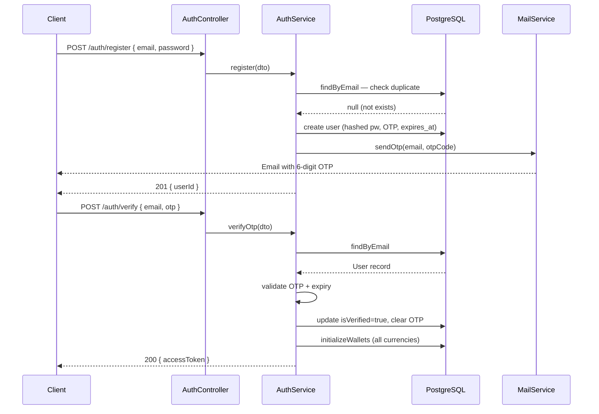
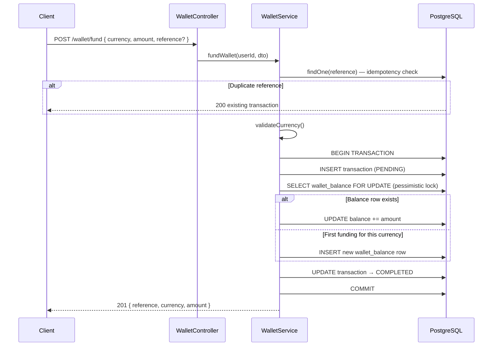
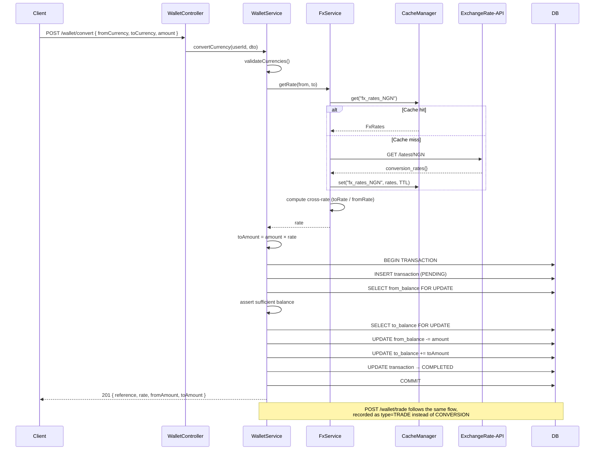

# FX Trading App — Backend

A production-ready NestJS backend for an FX Trading App. Users can register, verify their email, fund multi-currency wallets, and trade/convert currencies using real-time FX rates.

---

## Tech Stack

| Layer | Technology |
|-------|-----------|
| Framework | NestJS (TypeScript) |
| ORM | TypeORM |
| Database | PostgreSQL |
| Authentication | JWT (Passport) |
| Email | Nodemailer (Gmail SMTP) |
| FX Rates | ExchangeRate-API (v6) |
| Caching | NestJS Cache Manager (in-memory or Redis) |
| Docs | Swagger / OpenAPI |

---

## Setup Instructions

### Prerequisites
- Node.js 18+
- Docker & Docker Compose (for local PostgreSQL)
- A free API key from [exchangerate-api.com](https://www.exchangerate-api.com)
- A Gmail account with an [App Password](https://myaccount.google.com/apppasswords) enabled

### 1. Clone & Install

```bash
git clone <repo-url>
cd fx-trading-app
npm install
```

### 2. Configure Environment

```bash
cp .env.example .env
```

Edit `.env` with your values:

```env
# Database
DB_HOST=localhost
DB_PORT=5432
DB_USERNAME=postgres
DB_PASSWORD=postgres
DB_DATABASE=fx_trading

# JWT
JWT_SECRET=your_super_secret_key
JWT_EXPIRES_IN=15m

# Gmail SMTP
MAIL_USER=your_email@gmail.com
MAIL_PASS=your_gmail_app_password

# FX Rate API
FX_API_KEY=your_exchangerate_api_key
```

### 3. Start PostgreSQL

```bash
docker-compose up -d
```

### 4. Run the Application

```bash
# Development (auto-sync DB schema)
npm run start:dev

# Production
npm run build
npm run start:prod
```

### 5. Access Swagger Docs

Open [http://localhost:3000/api](http://localhost:3000/api) in your browser.

---

## Running Tests

```bash
# Unit tests
npm run test

# Test coverage
npm run test:cov
```

---

## API Documentation

Full interactive docs available at `/api` (Swagger UI). Below is a summary.

### Authentication

| Method | Endpoint | Description | Auth |
|--------|----------|-------------|------|
| POST | `/auth/register` | Register user, sends OTP email | Public |
| POST | `/auth/verify` | Verify OTP, returns JWT | Public |
| POST | `/auth/login` | Login, returns JWT | Public |
| POST | `/auth/resend-otp` | Resend OTP to email | Public |

### Wallet

| Method | Endpoint | Description | Auth |
|--------|----------|-------------|------|
| GET | `/wallet` | Get all currency balances | Bearer JWT |
| POST | `/wallet/fund` | Fund wallet in any currency | Bearer JWT |
| POST | `/wallet/convert` | Convert between currencies | Bearer JWT |
| POST | `/wallet/trade` | Trade currencies (NGN ↔ others) | Bearer JWT |

### FX Rates

| Method | Endpoint | Description | Auth |
|--------|----------|-------------|------|
| GET | `/fx/rates?base=NGN` | Get live FX rates | Bearer JWT |
| GET | `/fx/supported` | List supported currencies | Public |

### Transactions

| Method | Endpoint | Description | Auth |
|--------|----------|-------------|------|
| GET | `/transactions?page=1&limit=20&type=TRADE` | Paginated history | Bearer JWT |

### Admin

| Method | Endpoint | Description | Auth |
|--------|----------|-------------|------|
| GET | `/admin/users` | List all registered users | Bearer JWT (Admin only) |

### Analytics

| Method | Endpoint | Description | Auth |
|--------|----------|-------------|------|
| GET | `/analytics/trades` | Trade volume & counts by type/currency (last 30 days) | Bearer JWT (Admin only) |
| GET | `/analytics/fx-trends?currency=USD&days=7` | Historical FX rate snapshots for a currency | Public |
| GET | `/analytics/users/:id/activity` | Transaction summary for a specific user | Bearer JWT (Admin only) |

### Example: Register → Verify → Trade

**1. Register**
```http
POST /auth/register
Content-Type: application/json

{ "email": "user@example.com", "password": "StrongPass123!" }
```

**2. Verify OTP** (check email for 6-digit code)
```http
POST /auth/verify
Content-Type: application/json

{ "email": "user@example.com", "otp": "482931" }
```
Returns `accessToken`.

**3. Fund NGN wallet**
```http
POST /wallet/fund
Authorization: Bearer <accessToken>
Content-Type: application/json

{ "currency": "NGN", "amount": 50000 }
```

**4. Convert NGN → USD**
```http
POST /wallet/convert
Authorization: Bearer <accessToken>
Content-Type: application/json

{ "fromCurrency": "NGN", "toCurrency": "USD", "amount": 1000 }
```

**Response:**
```json
{
  "message": "Conversion successful",
  "reference": "a3f1c2d4-...",
  "fromCurrency": "NGN",
  "toCurrency": "USD",
  "fromAmount": 1000,
  "toAmount": 0.65,
  "rate": 0.00065
}
```

---

## Flow Diagrams

### Registration & OTP Verification



### Wallet Funding



### Currency Conversion & Trading



---

## Architectural Decisions

### Multi-Currency Wallet: Row-per-Currency Model
Each currency balance is a separate row in `wallet_balances (user_id, currency, balance)` with a unique constraint on `(user_id, currency)`. This allows unlimited currencies without schema changes and enables atomic per-row locking.

### Double-Spend Prevention: Pessimistic Locking
All balance mutations use `SELECT ... FOR UPDATE` (PostgreSQL row-level write lock) inside a TypeORM transaction. This serializes concurrent requests for the same currency balance and eliminates race conditions.

### FX Rate Caching: Stale-While-Revalidate
Rates are cached in-memory for 60 seconds (configurable via `FX_CACHE_TTL`). On API failure, the service falls back to the last successfully fetched rates rather than failing hard, ensuring trading continuity during brief API outages.

### Cross-Rate Calculation
All FX rates are stored relative to NGN. For cross-currency conversions (e.g., USD → EUR), the rate is computed as `EUR_rate / USD_rate` from the NGN-based rate table, ensuring a single API call covers all supported pairs.

### Idempotency
Every mutation (fund, convert, trade) accepts an optional `reference` UUID. If a request with the same reference arrives twice, the second call returns the original transaction without re-executing — preventing duplicate processing from network retries.

### Transaction Status Lifecycle
Transactions are created in `PENDING` state before any balance updates begin. On success they move to `COMPLETED`; on failure the transaction is rolled back and marked `FAILED`. This provides an audit trail even for failed operations.

### FX Rate Snapshots for Analytics
Every time a fresh rate fetch succeeds, all currency rates are persisted as rows in `fx_rate_snapshots (base, currency, rate, fetchedAt)`. This is fire-and-forget (non-blocking) and enables historical FX trend queries via `GET /analytics/fx-trends`. The snapshot store grows over time and can be pruned by a scheduled job in production.

### JWT Authentication
Global JWT guard applied via `APP_GUARD` — all endpoints require authentication by default. Routes opt out using the `@Public()` decorator. This is safer than opt-in authentication (forgetting to add a guard).

---

## Key Assumptions

1. **Funding is trust-based** — no payment gateway. A production system would integrate Paystack/Flutterwave.
2. **FX base currency is NGN** — all rates are fetched relative to Naira. Cross-rates are derived mathematically.
3. **Supported currencies**: NGN, USD, EUR, GBP, CAD, JPY — configurable via `SUPPORTED_CURRENCIES` env var.
4. **Email delivery** — Gmail SMTP with App Password. Production should use SendGrid/Mailgun.
5. **No refresh tokens** — access tokens expire in 15 minutes. Production should add refresh token rotation.
6. **Schema auto-sync** — `synchronize: true` in development only. Production should use TypeORM migrations.
7. **Cache** — defaults to in-memory. Set `REDIS_HOST` to switch to Redis automatically (no code changes needed).

---

## Scaling Considerations

- **Redis caching is already supported** — set `REDIS_HOST` in `.env` to enable it for multi-instance deployments
- Use TypeORM migrations instead of `synchronize: true` in production
- Add a message queue (Bull/BullMQ) for async operations like email sending
- Implement rate limiting (`@nestjs/throttler`) to prevent abuse
- Add a payment gateway (Paystack/Flutterwave) for real funding flows
- Consider read replicas for transaction history queries under heavy load

---

## Bonus Features Implemented

| Feature | Status | Details |
|---------|--------|---------|
| **Role-Based Access Control** | ✅ Done | `UserRole.USER` / `UserRole.ADMIN` enum, `@Roles()` decorator, `RolesGuard`, admin endpoints under `/admin/*` and `/analytics/*` |
| **Redis Caching** | ✅ Done | `CacheModule` auto-switches to Redis when `REDIS_HOST` is set; falls back to in-memory. FX rates cached with configurable TTL |
| **Idempotency** | ✅ Done | Optional `reference` field on all wallet operations (fund/convert/trade). Duplicate reference returns existing transaction instead of re-executing |
| **Analytics & Activity Logging** | ✅ Done | `GET /analytics/trades` — trade volume by type/currency; `GET /analytics/fx-trends` — historical FX rate snapshots stored on every live fetch; `GET /analytics/users/:id/activity` — per-user transaction summary |
